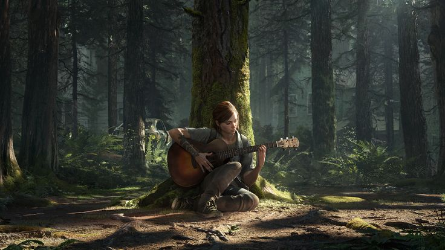

# Hola-Mundo

Vamos a hacer una prueba para volver al estado incial del proyecto
  -Hemos comprobado que podemos descargarnos versiones anteriores y trabajar en ellas

Vamos a añadir fotos entre el texto
  

Vamos a añadir un link
  -[MarinaIslandia](https://github.com/MarinaIslandia/Hola-Mundo)

Ellie Williams

Ellie Williams es el personaje central de la serie The Last of Us. Es la deuteragonista de The Last of Us: Parte I, el episodio extra Left Behind y The Last of Us: Parte II, y el personaje principal de American Dreams. El personaje es interpretado por Ashley Johnson.

Cuando conocemos a Ellie por primera vez, es una chica de 14 años que no conoció el mundo "normal" anterior a 2013. Por lo tanto, Joel no se convierte solo en su transportador, sino también en un guía para el mundo. Es precoz, ingeniosa y capaz. Ya sea con sus juegos de palabras o superando crisis, su astucia e ingenio demuestran ser invaluables. 5 años después, cuando un evento traumático la sacude a ella y a su comunidad, emprende un viaje en busca de venganza. Si bien maduró, debe vérselas no solo contra sus adversarios, humanos e infectados, sino también contra la carga emocional de sus acciones.
